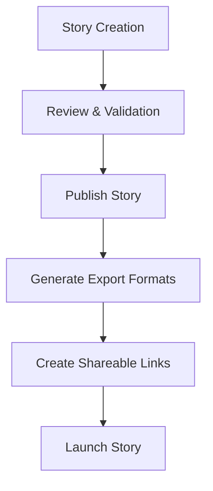
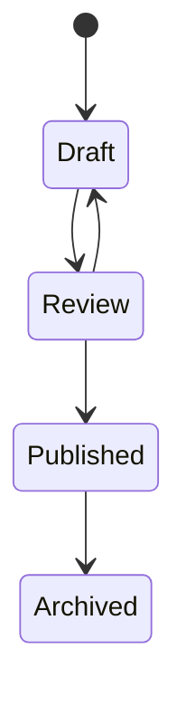

# Story Builder Architecture Design

## Current State Analysis

The story-builder feature currently has:

- Frontend UI with timeline, graph, and mountains views
- Analysis API endpoints for graph algorithms
- Graph data API for visualization
- Timeline events and mountains collections in Payload
- Basic entity and relationship management

## Missing Functionality

1. **Story Submission**: No way to send/launch completed stories
2. **Publication Workflow**: Missing draft/published states and workflow
3. **Export Formats**: No export functionality for stories
4. **Sharing Mechanism**: No way to share stories with others
5. **Launch Integration**: No integration with external platforms

## Architecture Design

### 1. Database Schema Enhancements

#### New Collections/Fields Needed:

```typescript
// Add to TimelineEvents collection
{
  name: 'status',
  type: 'select',
  options: ['draft', 'review', 'published', 'archived'],
  defaultValue: 'draft',
  required: true
}

// Add to Mountains collection
{
  name: 'publishedAt',
  type: 'date',
  admin: { hidden: true }
}

// New StoryPublication collection
{
  slug: 'story-publications',
  fields: [
    {
      name: 'title',
      type: 'text',
      required: true
    },
    {
      name: 'mountains',
      type: 'relationship',
      relationTo: 'mountains',
      hasMany: true,
      required: true
    },
    {
      name: 'events',
      type: 'relationship',
      relationTo: 'timeline-events',
      hasMany: true,
      required: true
    },
    {
      name: 'publicationDate',
      type: 'date',
      required: true
    },
    {
      name: 'status',
      type: 'select',
      options: ['draft', 'published', 'archived'],
      defaultValue: 'draft'
    },
    {
      name: 'exportFormats',
      type: 'select',
      hasMany: true,
      options: ['pdf', 'html', 'markdown', 'json']
    },
    {
      name: 'shareUrl',
      type: 'text'
    },
    {
      name: 'viewCount',
      type: 'number',
      defaultValue: 0
    }
  ]
}
```

### 2. API Endpoints Design

#### New Endpoints Required:

1. **POST /api/story-builder/publish**
   - Input: Story data (mountains, events, metadata)
   - Process: Validate, create publication record, update statuses
   - Output: Publication ID and share URL

2. **GET /api/story-builder/publications**
   - Input: Optional filters (status, date range)
   - Output: List of publications with metadata

3. **GET /api/story-builder/export**
   - Input: Publication ID, format type
   - Process: Generate export in requested format
   - Output: File download or URL

4. **POST /api/story-builder/share**
   - Input: Publication ID, sharing options
   - Process: Generate shareable link, update permissions
   - Output: Share URL and embed code

### 3. Frontend Components

#### New Components Needed:

1. **PublicationModal**: Modal for publishing stories
2. **ExportPanel**: Panel for export options and download
3. **ShareDialog**: Dialog for sharing published stories
4. **StoryLauncher**: Component to launch/view published stories

#### Component Structure:

```
StoryBuilder
├── PublicationControls (new)
│   ├── PublishButton
│   ├── ExportButton
│   └── ShareButton
├── TimelineView
├── GraphView
├── MountainsView
└── PublicationModal (new)
```

### 4. Workflow Design

#### Story Publication Workflow:



#### Status Transitions:



### 5. Cloudflare Integration

#### Database Connection:

- Use existing Payload configuration for Cloudflare
- Ensure proper access control for publication endpoints
- Implement rate limiting for public endpoints

#### Storage:

- Use Cloudflare R2 for storing exported files
- Implement signed URLs for secure access
- Cache public stories at edge locations

### 6. Security Considerations

1. **Access Control**:
   - Only authenticated users can publish
   - Public read access for published stories
   - Admin-only for archiving

2. **Data Validation**:
   - Validate all story data before publication
   - Sanitize HTML content in exports
   - Rate limiting on export generation

3. **Content Security**:
   - Implement CSP headers for public stories
   - Sanitize user-generated content
   - Secure file uploads

### 7. Implementation Plan

#### Phase 1: Database Schema

- Add status field to TimelineEvents
- Create StoryPublication collection
- Update access control rules

#### Phase 2: Backend APIs

- Implement publication endpoint
- Create export generation service
- Build sharing functionality

#### Phase 3: Frontend UI

- Add publication controls to StoryBuilder
- Create publication modal
- Implement export and share dialogs

#### Phase 4: Cloudflare Integration

- Configure R2 storage for exports
- Set up edge caching for public stories
- Implement security headers

#### Phase 5: Testing

- Unit tests for API endpoints
- Integration tests for workflow
- End-to-end testing of publication process
